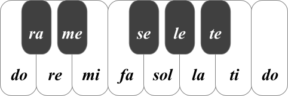

An Introduction to Chromatic-Solfege
====================================

Chromatic Solfege is a variant of Solfege. Solfege's note name system is base on
a diatonic scale; therefore, by the traditional Solfege, there are some
difficulties to read songs which are polymodal . Chromatic Solfege is based on
the twelve-note chromatic scale and it is suitable to read such songs.

In Chromatic Solfege, there are two scales as :

#### The Augumented Chromatic Scale ( Ascending )

#### The Diminished Chromatic Scale ( Descending )

